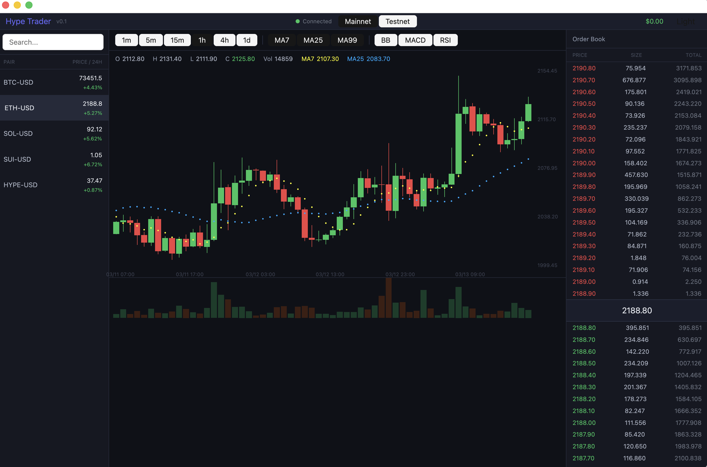

# Hype Trader

A desktop trading client for [Hyperliquid](https://hyperliquid.xyz/) DEX, built with Rust and GPUI.

Trade perpetual futures with real-time market data, interactive charting, order management, and position tracking.



## Features

- Real-time order book and market data via WebSocket
- Interactive candlestick charting with zoom, pan, and crosshair
- Technical indicators: Bollinger Bands, MACD, RSI, Moving Averages
- Order placement and management (market, limit)
- Position tracking with PnL
- Encrypted local wallet key storage (AES-256)
- Mainnet / Testnet network switching
- Dark / Light theme

## Prerequisites

- [Rust](https://www.rust-lang.org/tools/install) (stable toolchain)

```sh
curl --proto '=https' --tlsv1.2 -sSf https://sh.rustup.rs | sh
```

## Build & Run

```sh
# Debug build
cargo run

# Release build (recommended)
cargo build --release
./target/release/hype-trader
```

## First Launch

On startup the app shows a welcome screen with three options:

1. **Enter private key** — connect your Hyperliquid wallet
2. **Load saved wallet** — use a previously saved key from `~/.hype-trader/config.toml`
3. **Read-only mode** — browse market data without trading

Configuration is stored at `~/.hype-trader/config.toml`.

## Project Structure

```
src/
├── main.rs                 # Entry point
├── models.rs               # Data types (Symbol, Candle, Order, …)
├── state.rs                # Global AppState
├── components/
│   ├── input_field.rs      # Text input widget
│   ├── pnl_text.rs         # PnL display
│   ├── stat_card.rs        # Stat card widget
│   ├── status_dot.rs       # Status indicator
│   ├── table.rs            # Table widget
│   ├── theme.rs            # Theming
│   └── toggle_button.rs    # Toggle button widget
├── services/
│   ├── config_service.rs   # Config load/save
│   ├── wallet_service.rs   # Key management
│   ├── info_service.rs     # Market data queries
│   ├── exchange_service.rs # Order placement
│   └── ws_service.rs       # WebSocket streaming
└── views/
    ├── welcome_view.rs     # Login screen
    ├── main_view.rs        # Trading dashboard
    ├── candle_chart.rs     # OHLCV charting
    ├── order_book.rs       # Bid/ask display
    ├── order_panel.rs      # Order entry
    ├── symbol_list.rs      # Trading pairs
    ├── bottom_panel.rs     # Positions/orders/history
    ├── top_bar.rs          # Network/account/theme
    └── toast.rs            # Notifications
```
